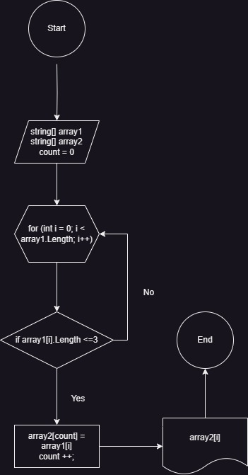

ИТОГОВАЯ КОНТРОЛЬНАЯ РАБОТА

Условие задачи
Написать программу, которая из имеющегося массива строк формирует новый массив из строк, длина которых меньше, либо равна 3 символам. Первоначальный массив можно ввести с клавиатуры, либо задать на старте выполнения алгоритма. При решении не рекомендуется пользоваться коллекциями, лучше обойтись исключительно массивами.

Примеры

[“Hello”, “2”, “world”, “:-)”] → [“2”, “:-)”]
[“1234”, “1567”, “-2”, “computer science”] → [“-2”]
[“Russia”, “Denmark”, “Kazan”] → []

1. Создать репозиторий на GitHub
2. Нарисовать блок-схему алгоритма (можно обойтись блок-схемой основной содержательной части, если вы выделяете её в отдельный метод)
3. Снабдить репозиторий оформленным текстовым описанием решения (файл README.md)
4. Написать программу, решающую поставленную задачу
5. Использовать контроль версий в работе над этим небольшим проектом (не должно быть так, что всё залито одним коммитом, как минимум этапы 2, 3, и 4 должны быть расположены в разных коммитах)

Решение задачи
1. Cоздаем счетчик в методе, переменную "count", для копирования элементов из "array1" в "array2".
2. Далее  проверяем условия внутри цикла при помощи "for", если "yes",то элемент массива заносится в счетчик элементов "array2", исходя из этого увеличивается переменная величина счетчика на единицу и возвращаемся к циклу, в котором i увеличивается на единицу. Делаем так, пока не проверим все элементы.
После завершения цикла выводим массив на экран.

БЛОК СХЕМА

